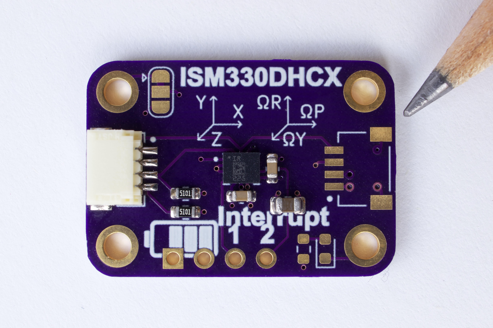
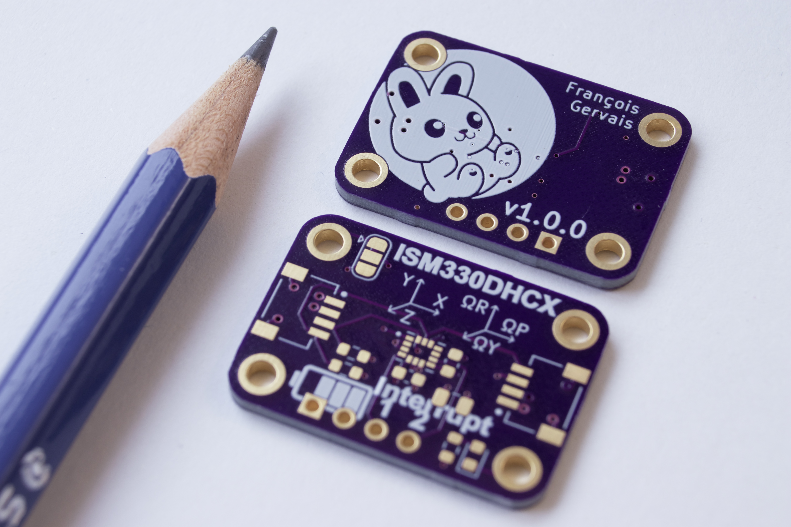

# ISM330DHCX Stemma QT Board



## Bus Pirate

### Read WHO_AM_I (Console)

```
HiZ> m
(1)> 4 (I2C)
(1)> 3 (~100KHz)

I2C> W
I2C> (1)
I2C> [0xd4 0x0f [0xd5 r]
I2C> w
```


## OSHPark

<a href="https://oshpark.com/shared_projects/3tg55XeU" target="_blank">https://oshpark.com/shared_projects/3tg55XeU</a>



## Related Projects

<a href="https://github.com/fgervais/project-nrf-princess-dress" target="_blank">https://github.com/fgervais/project-nrf-princess-dress</a>
